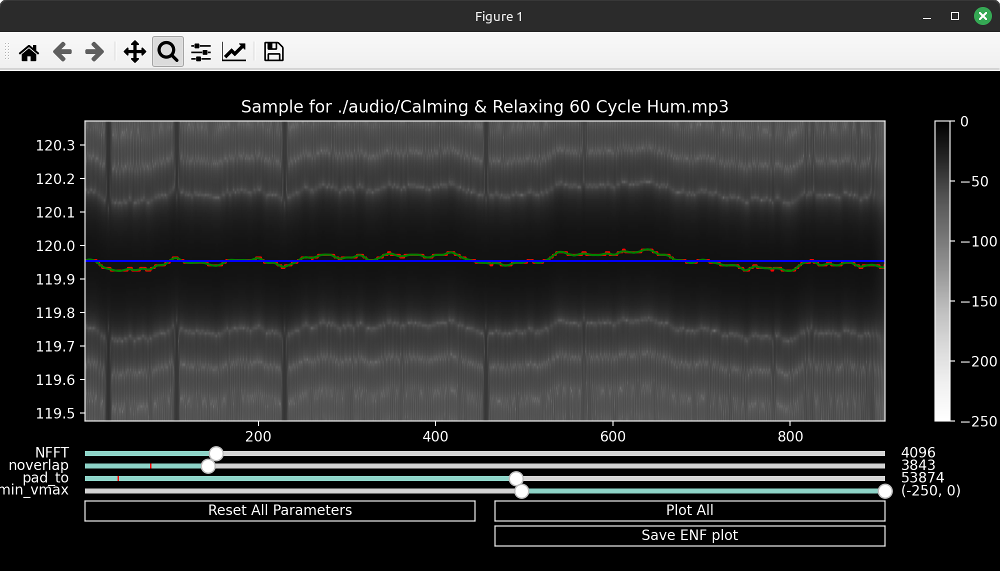
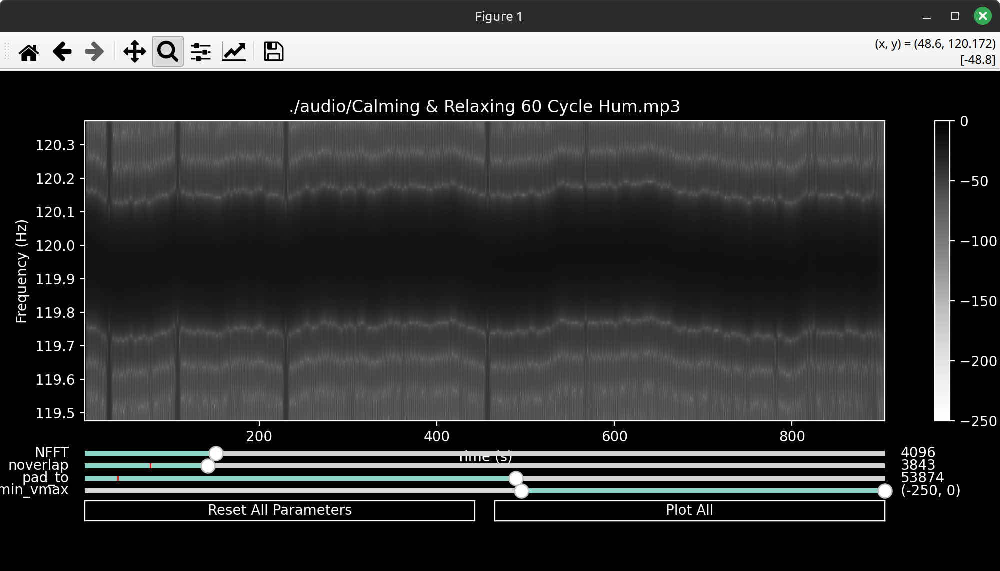

# ENF Extractor

Extract Electric Network Frequency (ENF) from an audio/video file for analysis.

*ENF from a recording of motors found at the 120Hz harmonic in the audio of a [youtube video](https://www.youtube.com/watch?v=uPY91zJfXUM").*

ENF Reference not included.

## How to use
Pass in a video or audio file as the first argument. 

> enf_extractor.py "./Calming & Relaxing 60 Cycle Hum.mp3"

|Flag|Description|
|---|---|
| -f | Target frequency to filter and center on plot. |
| -s | Interval to plot at a time. |

The tool will automatically extract audio from videos and place them into a ./audio/ directory. And show you the spectrogram.

Note the dark lines at approx. 60Hz, 120Hz and 180Hz. This is the ENF of a 60Hz alternating current and its harmonics at 120Hz and 180Hz

The 120Hz harmonic is more visible, probably due to less signals interfering at that frequency, so I will use that one. I use the matplotlib zoom tool at the top-left of the window to center around 120Hz and the sliders at the bottom to tweak the spectrogram.

### Sliders

The sliders are used to tweak the spectrogram parameters for better ENF extraction. The most relevant ones for extraction are NFFT, n_overlap and pad_to.

You can watch this video by Aniel Maharajh for an short (10m) but in depth explanation of how they work

Or check out my working explanation below.
| Slider | Description |
| ------ | ----------- |
| NFFT | The **NFFT** is the number of points used in each block for the FFT. This can control frequency definition vertically. The larger the block the better the time component (how the frequency changes), the smaller it is the better the frequency component (what frequencies exist in that block). The default value of 4096 is good for our application. |
| n_overlap | The **n_overlap** is the number of points to overlap between these blocks. The closer to NFFT the more time you get resolution but it cannot be larger than NFFT-1. |
| pad_to | The **pad_to** slider controls the length of the transformed axis of the output. If its smaller than the length of the input the output gets cropped, if its larget it gets padded. This can increase vertical resolution. |
| vmin_vmax | Defines the range of the colormap. Use it to highlight specific levels you want to see.  |

Please note that this is all limited by the quality of your recording. If your recording is low quality you won't be able to extract a lot of detail from the image. You can usually tell that your recording is low quality or compressed by a large amount of horizontal lines when you plot.

## Plot

Once you have centered the view on the frequency you want to extract, press the Plot All button and the program will select the highest frequencies within the view.

## Passing in a target frequency

Pass in a target frequency with the -f flag to apply a bandpass signal around that target frequency and also center the plot on that frequency.

> enf_extractor.py "./Calming & Relaxing 60 Cycle Hum.mp3" -f 120

## Segmented Plotting

The program also allows you to plot specific intervals of the signal at a time by passing in the amount of seconds you want to plot at a time you can work with low memory. 

> enf_extractor.py "./Calming & Relaxing 60 Cycle Hum.mp3" -f 120 -s 100

Note that the signal length is only around 90 seconds long in the previous image.

Once plotted it will look like this.
The bottom graph is the whole signal and the top graph is only the current portion of the signal being calculated.

## Save

Press the Save ENF plot button to save the data to a .CSV file with the same name.

## Aditional reading (they're free online):

Grigoras, C. (2005). Digital audio recording analysis: the Electric Network Frequency (ENF) Criterion. International Journal of Speech, Language and the Law, 12(1), 63-76. https://doi.org/10.1558/sll.2005.12.1.63

Jr, Ojowu, & Karlsson, Johan & Li, Jian & Liu, Yilu. (2012). ENF Extraction From Digital Recordings Using Adaptive Techniques and Frequency Tracking. IEEE Transactions on Information Forensics and Security. 7. 1330-1338. [10.1109/TIFS.2012.2197391. ](https://doi.org/10.1109/TIFS.2012.2197391)