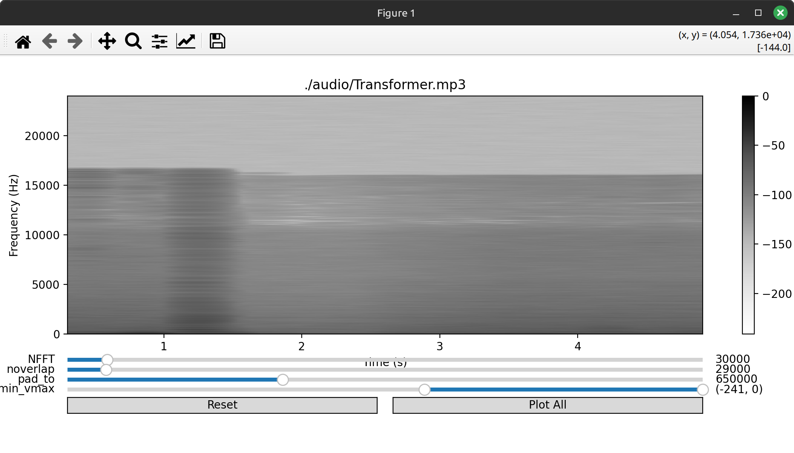
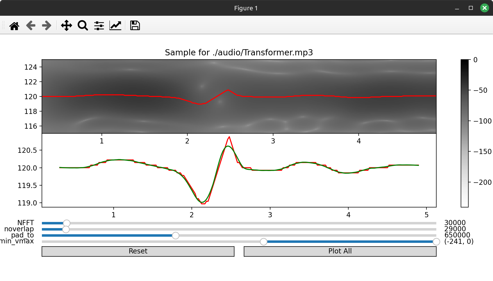
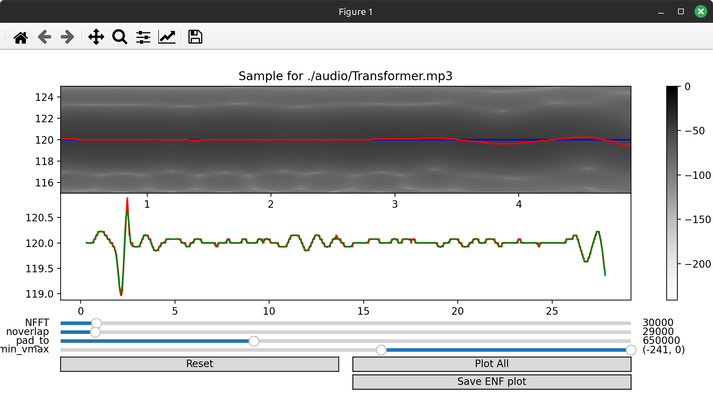

# ENF Extractor (work in progress)

Pass in a video or audio file as the first argument. If the file is a video it will extract the audio from a video into an ./audio/ directory.

---

The script loads in a small segment of the audio file so you can tweak the spectogram using sliders. The parameters you set into the spectogram will be used to plot the whole audio file segment by segment.

> enf_extractor.py ./audio/Transformer.mp3

---

The second argument would be the frequency. If the second argument is passed the script will center the spectogram within +-5 Hz of that frequency and apply a butterworth filter around +-1 Hz of the given frequency.

> enf_extractor.py ./audio/Transformer.mp3 120

---

After tweaking the parameter and when ready to extract press "Plot All" and the script will commence the plotting of the ENF around the frequencies visible in the window.

When the script is done plotting a button will appear that allows you to save the signal visible on the bottom plot. It will be saved as a csv file with the name of the audio file passed in/extracted and the current date.

Work in progress