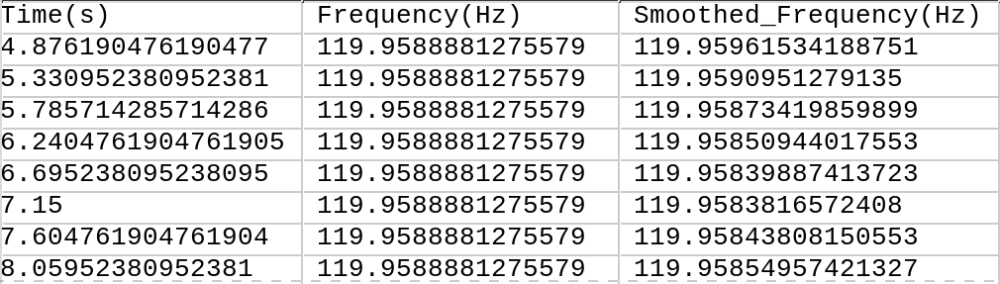

# ENF Extractor

Extract Electric Network Frequency (ENF) from an audio/video file as CSV for analysis.

<p align="center">
  
</p>

*The clip shows ENF from a recording of motors found at the 120Hz harmonic in the audio of a [youtube video](https://www.youtube.com/watch?v=uPY91zJfXUM").*

ENF Reference not included.

## Table of Contents
- [ENF Extractor](#enf-extractor)
  - [Table of Contents](#table-of-contents)
  - [Features](#features)
  - [Installation](#installation)
  - [Usage](#usage)
    - [Basic Usage](#basic-usage)
      - [Command Line Options](#command-line-options)
    - [Interface Guide](#interface-guide)
      - [Spectrogram View](#spectrogram-view)
        - [Slider Controls](#slider-controls)
      - [Plotting Features](#plotting-features)
      - [Segmented Processing: Handle large files in sections](#segmented-processing-handle-large-files-in-sections)
      - [Saving Results](#saving-results)
  - [Technical Notes](#technical-notes)
  - [References (you can find them online easily):](#references-you-can-find-them-online-easily)

## Features
- Extract ENF signals from audio/video files
- Visual spectrogram analysis
- Adjustable FFT parameters via interactive sliders
- Target frequency filtering
- Segmented processing for large files
- CSV export functionality

## Installation
```bash
git clone [repository-url]
cd enf-extractor
pip install -r requirements.txt
```
## Usage

### Basic Usage
```bash
python enf_extractor.py "path/to/your/file.mp3"
```

#### Command Line Options
|Flag|Description|Type|
|---|---|---|
| -f | Target frequency to filter and center on plot. |-f 120|
| -s | Time interval (in seconds) to plot at once |-s 100|

### Interface Guide

#### Spectrogram View

Initial Spectrogram

If you pass in a video, the tool will automatically extract audio (saved to ./audio/) and display the spectrogram.


American ENF signals appear at:
- 60Hz (fundamental frequency)
- 120Hz (first harmonic)
- 180Hz (second harmonic)

##### Slider Controls

The interactive sliders adjust spectrogram parameters for optimal ENF extraction. Check out my working explanation:

| Slider | Description |
| ------ | ----------- |
| NFFT | The **NFFT** is the number of points used in each block for the FFT. This can control frequency definition vertically. The larger the block the better the time component (how the frequency changes), the smaller it is the better the frequency component (what frequencies exist in that block). The default value of 4096 is good for our application. |
| n_overlap | The **n_overlap** is the number of points to overlap between these blocks. The closer to NFFT the more time points, but it cannot be larger than NFFT-1.  |
| pad_to | The **pad_to** slider controls the length of the transformed axis of the output. If its smaller than the length of the input the output gets cropped, if its larget it gets padded. This can increase the amount of vertical points. |
| vmin_vmax | Defines the range of the colormap. Use it to highlight specific levels you want to see.  |

For a detailed explanation, watch this [FFT Parameters Tutorial](https://www.youtube.com/watch?v=_RoSWJiclvQ) on youtube.

#### Plotting Features

Target Frequency Mode:

```bash
python enf_extractor.py "./Calming & Relaxing 60 Cycle Hum.mp3" -f 120
```

Note that the plot has been centered on the frequency passed in through the -f flag and the signal has also been filtered to +-1Hz of that frequency.


#### Segmented Processing: Handle large files in sections

```bash
python enf_extractor.py "./Calming & Relaxing 60 Cycle Hum.mp3" -f 120 -s 100
```

Note that the signal length has been reduced to about 100 seconds.


When you press the Plot All button the view will split showing the current segment at the top and the total ENF graph at the bottom.


#### Saving Results

Click "Save ENF plot" to export data as a CSV file:



## Technical Notes
- ENF is not always present in a recording.
- All recordings have a quality limit you can't pass no matter how much you tweak the spectrogram. (No "Enhance")
  - Some audio recordings are compressed, you will know because compression artifacts usually appear as horizontal lines in the ENF.
- The signal is downsampled to 420Hz, which limits the amount of frequencies you can view. ([Nyquist Frequency](https://en.wikipedia.org/wiki/Nyquist_frequency))
- Memory requirements increase really fast with file size and FFT parameters.

## References (you can find them online easily):
    
    Grigoras, C. (2005). Digital audio recording analysis: the Electric Network Frequency (ENF) Criterion. International Journal of Speech, Language and the Law, 12(1), 63-76. https://doi.org/10.1558/sll.2005.12.1.63

    Jr, Ojowu, & Karlsson, Johan & Li, Jian & Liu, Yilu. (2012). ENF Extraction From Digital Recordings Using Adaptive Techniques and Frequency Tracking. IEEE Transactions on Information Forensics and Security. 7. 1330-1338. https://doi.org/10.1109/TIFS.2012.2197391

